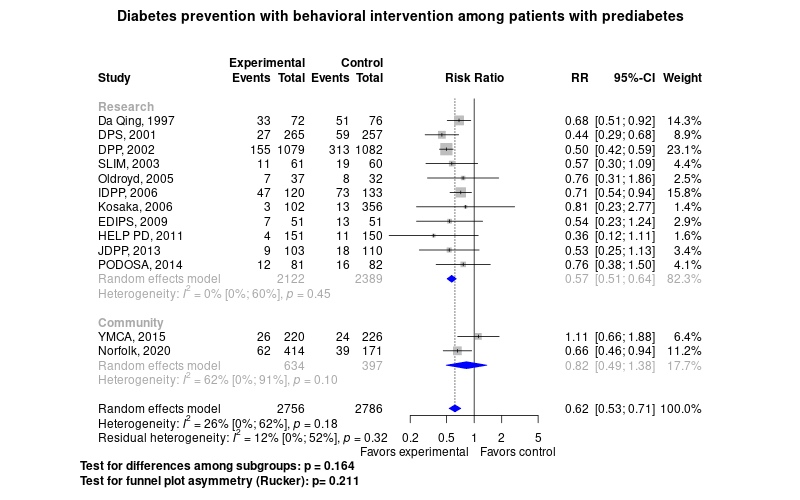

Diabetes prevention with behavioral counseling of patients with prediabetes
============================================
A living systematic review

Short url: http://openmetaanalysis.github.io/Diabetes-prevention

**Clinical summary:** This meta-analysis suggests that clinical intervention *is* effective. Heterogeneity of results as measured by I2 '[might not be important](http://handbook-5-1.cochrane.org/chapter_9/9_5_2_identifying_and_measuring_heterogeneity.htm)' at 26%. This review updates previously published meta-analysis(es).(citation[s] below)

Meta-regression of common modulators (year of publication, study size, event rate in the control groups) finds that the outcome of the intervention is effected by xx.
* [Reconciliation of conclusions with prior meta-analyses](files/reconciliation-tables/Reconciliation%20of%20conclusions.pdf) (under construction)
* [Keep current with this topic](files/searching/Keep-up.md) (under construction)

Acknowledgement: we acknowledge the essential work by the authors of the prior [systematic review(s)](#systematic-reviews) listed below.

**Methods overview:** This repository is an [openMetaAnalysis](https://openmetaanalysis.github.io/) that combines methods of scoping, rapid, and living systematic reviews.  This analysis updates one or more previously published review(s) below. A comparison of studies included in this review compared to prior reviews are in the table, [reconciliation of trials included with prior meta-analyses/](files/reconciliation-tables/Reconciliation%20of%20studies.pdf). Newer studies included are listed in the references below. Rationale for newer trials excluded may be listed at the end of the references. 
* [Methods](http://openmetaanalysis.github.io/methods.html) for openMetaAnalysis
* [Evidence search](files/searching/evidence-search.md) for this review (under construction)

**Results:** Details of the studies included are in the:
* [Reconciliation of trials included with prior meta-analyses/](files/reconciliation-tables/Reconciliation%20of%20studies.pdf) (under construction)
* [Description of studies (PICO table)](files/study-details/table-pico.pdf) (under construction)
* [Risk of bias assessment](files/study-details/table-bias.pdf) (under construction)
* [Forest plots](../master/files/forest-plots) ([source data](files/data))
* [Network plots](../master/files/network) (optional)
* [Reconciliation of conclusions with prior meta-analyses](files/reconciliation-tables/Reconciliation%20of%20conclusions.pdf) (under construction)

The forest plot for the primary outcomes are below. Additional [forest plots](files/forest-plots) of secondary analyses may be available. 

<!--
The meta-regression for the primary outcomes are below. Additional [meta-regressions](files/metaregression) of secondary analyses may be available. 

The GRADE Profile is below. 
-->
References:
----------------------------------

### Systematic review(s)
#### Most recent review at time of last revision of this repository
1. Hemmingsen B, Gimenez-Perez G, Mauricio D, Roqué I Figuls M, Metzendorf MI, Richter B. Diet, physical activity or both for prevention or delay of type 2 diabetes mellitus and its associated complications in people at increased risk of developing type 2 diabetes mellitus. Cochrane Database Syst Rev. 2017 Dec 4;12(12):CD003054. doi: 10.1002/14651858.CD003054.pub4. PMID: [29205264](http://pubmed.gov/29205264); PMCID: PMC6486271.

### Randomized controlled trials
#### New trial(s) *not* included in the most recent review above
1. Sampson M, Clark A, Bachmann M, Garner N, Irvine L, Howe A, Greaves C, Auckland S, Smith J, Turner J, Rea D, Rayman G, Dhatariya K, John WG, Barton G, Usher R, Ferns C, Pascale M; Norfolk Diabetes Prevention Study (NDPS) Group. Lifestyle Intervention With or Without Lay Volunteers to Prevent Type 2 Diabetes in People With Impaired Fasting Glucose and/or Nondiabetic Hyperglycemia: A Randomized Clinical Trial. JAMA Intern Med. 2020 Nov 2:e205938. doi: 10.1001/jamainternmed.2020.5938. Epub ahead of print. PMID: [33136119](http://pubmed.gov/33136119); PMCID: PMC7607494.
2. Ackermann RT, Liss DT, Finch EA, Schmidt KK, Hays LM, Marrero DG, Saha C. A Randomized Comparative Effectiveness Trial for Preventing Type 2 Diabetes. Am J Public Health. 2015 Nov;105(11):2328-34. doi: 10.2105/AJPH.2015.302641. Epub 2015 Sep 17. PMID: [26378828](http://pubmed.gov/26378828); PMCID: PMC4605179.

#### Trial(s) included in the review above
See Hemmingsen et al.

#### Trial(s) undergoing review
None

#### Trial(s) excluded - selected list of important trial(s)

#### Cited by
This repository is cited by:

1. WikiDoc contributors. Pending content page. WikiDoc. Nov 9, 2014. Available at: http://www.wikidoc.org/index.php/This_topic. Accessed November 9, 2014. 

-------------------------------
[Cite and use this content](https://github.com/openMetaAnalysis/openMetaAnalysis.github.io/blob/master/reusing.MD)  - [Edit this page](../../edit/master/README.md) - [License](files/LICENSE.md) - [History](../../commits/master/README.md)  - 
[Issues and comments](../../issues?q=is%3Aboth+is%3Aissue)

